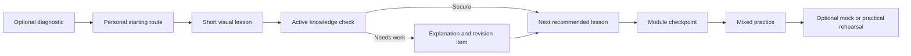

# PT Learning Lab — Product Blueprint

Status: Phase 0 complete enough to begin the approved vertical slice

Working title: **PT Learning Lab**

Curriculum basis: OriGym Level 3 Personal Trainer qualification
Initial audience: the owner, followed by a very small invited learner group

## 1. Product idea

PT Learning Lab will be a private, self-guided learning and revision site for the full Level 3 Personal Trainer curriculum. It will turn dense course material into short, visual lessons, active practice, practical coaching rehearsals and realistic mock assessments.

It is not an OriGym replacement, an accredited course provider, a tutor portal or a replica of the OriGym learning platform. It is an independent learning companion whose original material can be mapped clearly back to the OriGym course structure.

The product should feel like an intelligent training lab rather than an online textbook: learners see a concept, manipulate or apply it, check their understanding and know exactly what to revise next.

## 2. Agreed product boundaries

### Included

- The entire Level 3 curriculum, mapped to OriGym Modules 1–8.
- A recommended learning path with all content available from the start.
- Short lessons, deeper references, glossary and global search.
- Original diagrams, illustrations, questions and fictional client scenarios.
- Practice questions, knowledge checks, revision queues and full mock exams.
- Practical-assessment rehearsal through guided scenarios and checklists.
- Learning progress, bookmarks and reset/export/delete controls.
- Responsive use on phones and first-class use on laptops.
- Passwordless email access for invited users.
- A private owner interface for reviewing and publishing content.
- Minimal, privacy-conscious product analytics.

### Explicitly excluded from the first version

- Tutor dashboards, marking or learner management workflows.
- Learner-to-learner messaging, comments or community features.
- Public registration, payments and certificates.
- Video recording or automated judging of practical performance.
- Narration and complex animation.
- Free-form learner notes.
- An open-ended AI tutor.
- Copying OriGym quiz or exam questions.
- Publishing personal consultation forms, assessor feedback, financial records or identifiable client information from the source folders.

Later versions may add account blocking, narration, animation, notes and a source-grounded AI assistant, but the initial architecture should not prevent them.

## 3. Product principles

1. **Learn actively.** Every lesson asks the learner to identify, order, choose, calculate, diagnose or explain—not just read.
2. **Show before telling.** Prefer labelled diagrams, step sequences, comparisons and interactive states over long passages.
3. **Map transparently.** Every learning object displays its OriGym module and topic mapping.
4. **Explain every result.** Feedback says why an answer is correct, why alternatives are weaker and where to revise.
5. **Keep pressure optional.** Practice is supportive and untimed; realistic timing appears only when the learner chooses a mock.
6. **Make progress meaningful.** Progress reflects demonstrated understanding, not clicks or time spent.
7. **Stay within professional scope.** Health and nutrition content teaches Level 3 PT responsibilities, boundaries and referral decisions.
8. **Separate course alignment from currency.** The product distinguishes “what the qualification expects” from current professional guidance.
9. **Be adult and playful.** Use purposeful challenges, satisfying feedback and visible mastery without childish badges or artificial streak pressure.
10. **Protect provenance and privacy.** Content has sources, review status and version history; personal source records never become learning content.

## 4. Curriculum architecture

The default route follows the OriGym module order because that is the easiest sequence for learners to map against their qualification. Within modules, lessons are reordered where necessary to create a clearer conceptual progression.

| Module | Portal-aligned subject | Proposed learning clusters |
|---|---|---|
| 1 | Anatomy, physiology and principles of fitness | Anatomical language; skeleton and bony landmarks; joints; fitness components; effects of exercise; nutrition and micronutrients |
| 2 | Applied anatomy, posture, flexibility and marketing | Pelvis; spine; joint actions; posture and core stability; flexibility; essential marketing terminology |
| 3 | Muscular and nervous systems and macronutrients | Nervous system; connective tissue; muscle structure and fibres; major muscles and actions; origins and insertions; carbohydrates, protein and fats |
| 4 | Client consultation and programme preparation | Gathering information; screening and consent; consultation; SMART goals; safeguarding; data handling; professional and business boundaries |
| 5 | Nutrition for health and exercise | Energy systems; national guidance; nutrition and health; nutrition around exercise; scope of practice and referral |
| 6 | Body systems and the working environment | Circulatory, respiratory, endocrine and digestive systems; food quality; PT environments; preparing the trainer, client and facilities |
| 7 | Delivering and programming personal training | Warm-up and cool-down; monitoring intensity; resistance training; contraindications and special populations; instruction and adaptation; advanced systems; programme design |
| 8 | Assessment preparation | Anatomy and physiology mock exams; nutrition mock exams; practical planning and rehearsal; assessment-day readiness |

Every cluster contains:

- a clear outcome written as “By the end, you can…”;
- one or more short lessons;
- a visual or interactive explanation;
- an immediate knowledge check;
- a link to the deeper reference;
- OriGym module/topic labels;
- source and review metadata;
- related glossary terms;
- revision items generated from learner performance.

## 5. Learning modes

### Learn

The recommended route through new material. Lessons take approximately 5–10 minutes and combine explanation with interaction. A learner can leave at any point and resume from the last meaningful step.

### Check

Low-pressure practice organised by topic, module or revision priority. Feedback is immediate. Questions can be repeated, but the site varies examples and distractors where possible.

### Revise

An automatically generated, explainable queue. Each item displays why it has appeared, for example:

- “You confused flexion and extension yesterday.”
- “This topic is due for a confidence check.”
- “You have not yet demonstrated this learning outcome.”
- “This is a prerequisite for your next programme-design lesson.”

### Mock

Assessment simulation with delayed feedback. Learners can choose untimed, optionally timed or fully realistic mode. Results show topic-level gaps without pretending to predict an official result.

### Reference

A searchable knowledge base for quick lookup. It supports study and later professional reference without forcing the learner through a lesson.

### Rehearse

Guided practical scenarios. The learner plans what they would say, demonstrate, observe and adapt, then checks their approach against a structured model and checklist.

## 6. Core learner journey



The diagnostic is always optional. It changes recommendations, never locks content or labels a learner as weak.

## 7. Information architecture and screen map

```text
PT Learning Lab
├── Home
│   ├── Continue learning
│   ├── Today's revision
│   ├── Progress overview
│   └── Quick actions
├── Learn
│   ├── Recommended path
│   ├── OriGym module map
│   ├── Module overview
│   ├── Learning cluster
│   └── Lesson player
├── Practice
│   ├── Quick check
│   ├── Topic practice
│   ├── Module checkpoint
│   ├── Practical rehearsal
│   └── Mock exams
├── Reference
│   ├── Search
│   ├── Visual atlas
│   ├── Glossary
│   ├── Calculators
│   └── Bookmarks
├── Progress
│   ├── Curriculum coverage
│   ├── Knowledge confidence
│   ├── Revision history
│   └── Mock results
├── Account
│   ├── Profile and access
│   ├── Reminder preferences
│   └── Export, reset or delete data
└── Owner Studio
    ├── Content inventory
    ├── Lesson and question editor
    ├── Source and curriculum mapping
    ├── Review and preview
    ├── Version history
    └── Publish controls
```

## 8. Principal screen specifications

### 8.1 Home

The home screen answers four questions immediately:

1. What should I do next?
2. What needs revision?
3. How far have I progressed?
4. Can I quickly reach practice or reference material?

The primary card is **Continue learning**. A smaller **Today’s revision** card shows a finite queue and an honest time estimate. Module progress is visible but secondary. No social feed, leaderboard or promotional content appears.

### 8.2 Learn / Recommended path

Displays the clearest sequence as a connected route of learning clusters. All modules remain open. Each cluster shows:

- topic and one-line outcome;
- OriGym module badge;
- estimated time;
- status: not started, in progress, practised or secure;
- prerequisites and why they matter;
- recommended next action.

A toggle switches from **Recommended path** to **OriGym module map**, allowing direct comparison with the qualification structure.

### 8.3 Module overview

Introduces the module, its learning outcomes and its place in the broader course. It shows lesson clusters, module practice, mapped portal topics and practical relevance. Dense percentages are avoided; the emphasis is what the learner can now do.

### 8.4 Lesson player

Each 5–10 minute lesson follows a repeatable rhythm:

1. **Hook:** a practical question or visual problem.
2. **Outcome:** what the learner will be able to do.
3. **Explain:** concise text supported by an original visual.
4. **Explore:** label, reveal, sequence, compare or adjust something.
5. **Apply:** a realistic PT decision or client example.
6. **Check:** one to three retrieval questions.
7. **Close:** summary, confidence prompt and next recommendation.

The learner can open **Go deeper**, **Sources**, **Glossary** and **OriGym mapping** without losing their place.

### 8.5 Practice hub

Offers clear choices rather than a single question bank:

- revise what the system recommends;
- practise a chosen topic;
- take a module checkpoint;
- rehearse a practical situation;
- start a mixed or full mock.

Filters are simple: mode, module, topic and available time.

### 8.6 Question experience

Supported formats should include:

- single- and multiple-choice;
- label a diagram;
- order a sequence;
- match terms and definitions;
- identify an error;
- calculate a training value;
- choose and justify a coaching adaptation;
- build or critique a programme segment;
- short scenario decision trees.

Practice feedback is immediate and instructional. A correct answer still receives a concise rationale. Wrong options explain the underlying misconception rather than simply displaying a red cross.

### 8.7 Mock experience

Before starting, the learner chooses:

- **Study mock:** untimed, pause allowed;
- **Timed mock:** timer active, pause policy explained;
- **Assessment simulation:** realistic question count, time and delayed results.

The current OriGym format recorded during the portal review is:

- Anatomy and physiology: 50 questions, 90 minutes, 45 correct to meet the stated pass mark.
- Nutrition: 40 questions, 90 minutes, 36 correct to meet the stated pass mark.

These parameters must be versioned and rechecked before public release because assessment rules can change. All PT Learning Lab questions must be original.

### 8.8 Practical rehearsal

Practical rehearsal is a first-class mode, not a downloadable checklist. A scenario provides a fictional composite client, objective, environment and constraints. The learner works through:

1. pre-session screening and preparation;
2. exercise and training-system selection;
3. explanation and demonstration cues;
4. observation and correction;
5. regression, progression or substitution;
6. intensity monitoring;
7. session review and client feedback.

Initial rehearsals use guided choices, drag-and-order activities and self-check prompts. They do not record the learner or claim to assess competence.

The local practical guidance indicates rehearsal coverage should include a cardiovascular training system, four advanced resistance systems and a core exercise with a progression or regression. The content inventory should also resolve the current source gap around pyramids before that activity is written.

An anonymised scan of the private OriGym Facebook group reinforced that practical preparation should cover whole-session sequencing, choosing and explaining loads, RPE and cardiovascular-system decisions, and distinguishing advanced training systems. The evidence and privacy boundaries are recorded in `PT_LEARNING_LAB_FACEBOOK_GROUP_FINDINGS.md`.

### 8.9 Reference

Search returns lessons, glossary entries, visuals, calculators and deeper-reference pages. Results show their content type and module mapping. Reference pages are concise enough to use during revision and structured enough to support future professional lookup.

Initial calculators should be limited to those with clear teaching value, such as:

- target heart-rate or intensity-zone exploration;
- BMI as a contextual screening calculation with limitations clearly stated;
- energy or macronutrient examples strictly within qualification scope;
- simple programme-volume comparisons.

Calculators teach the method and interpretation; they do not give medical or personalised nutrition prescriptions.

### 8.10 Progress

Progress separates three ideas:

- **Coverage:** material encountered.
- **Practice:** material actively checked.
- **Security:** material answered correctly over time and in varied contexts.

A module can therefore be fully read but not yet secure. The progress screen shows this distinction visually and recommends the smallest useful next action.

### 8.11 Owner Studio

The private owner area supports a controlled content lifecycle:

```text
Draft → Source checked → Curriculum mapped → Owner approved → Published → Superseded
```

The owner can create and edit lessons, visuals, questions, glossary entries and scenarios; preview the learner experience; record sources; compare revisions; and publish or withdraw content. Every learner-facing item requires explicit owner approval before invited learners can see it.

## 9. Progress and revision model

### Learner-visible states

- Not started
- In progress
- Learned
- Practised
- Secure
- Due for revision

These are plain-language states, not mysterious scores.

### Evidence used for recommendations

- recency of the last successful recall;
- correctness across more than one question form;
- confidence after answering;
- repeated misconception patterns;
- prerequisite relationships;
- performance in mixed practice and mocks.

The system should never claim scientific precision it does not possess. Learners can always see and override the recommendation.

## 10. Visual and interaction language

The desired tone is friendly, precise and conversational. The interface should feel energetic and modern without resembling a children’s game or a generic corporate learning platform.

Original visual families should include:

- layered anatomy diagrams with selectable labels;
- movement sequences showing start, action and finish;
- planes, axes and joint-action explorers;
- muscle action and origin/insertion maps;
- system-flow diagrams for circulation, respiration, digestion and energy;
- exercise setup, execution and coaching-cue sequences;
- programme-building cards and timelines;
- client consultation and referral decision trees;
- compare-and-contrast cards for concepts that are easily confused.

Animation is deferred, but the visual system should support later transitions without relying on them for understanding.

Three visual directions should be explored before choosing the final system:

1. **Modern Anatomy Lab:** clean off-white canvas, ink-blue structure, warm coral functional highlights, precise editorial diagrams.
2. **Performance Notebook:** dark graphite headings, paper-like panels, electric lime or cyan interaction accents, purposeful coaching annotations.
3. **Human Movement Studio:** warm neutral base, deep teal and clay accents, softer organic illustrations and approachable photography-free scenes.

All directions must meet accessible contrast requirements and work equally well on phone and laptop.

### Selected visual direction

The selected direction is the original **Human Movement Studio** concept:

- warm sand, natural cream and paper-white learning surfaces;
- deep teal navigation, structure and primary actions;
- muted clay-red joint markers and movement arcs;
- small sage accents for revision and success states;
- warm contemporary humanist sans-serif typography;
- softly rounded cards and subtly organic illustration backdrops;
- spacious, practical layouts with clear mobile and laptop hierarchy;
- approachable three-stage movement illustrations.

The intended character is an approachable, grounded and capable human movement studio: friendly but precise, adult and qualification-ready. The later light-first hybrid exploration was not selected and should not replace this direction.

## 11. Content provenance and copyright rules

Every published learning object records:

- its OriGym curriculum mapping;
- local source document and page range, where applicable;
- any current external professional source;
- author/reviewer status;
- last review date;
- content version;
- whether it describes course requirements, current guidance or both.

The product may teach the same facts and competencies, but it should not copy distinctive course wording, diagrams, lesson media, question banks or assessment content. Originality reduces copyright risk but does not automatically eliminate it; content still needs source-aware review.

When current guidance differs from or expands on static course material, the interface uses two clearly labelled panels:

- **For your qualification**
- **In current professional practice**

High-change topics—including safeguarding, data protection, national nutrition guidance, referral, insurance and professional standards—require scheduled source review.

## 12. Privacy, access and account controls

The initial service is private and invite-only.

- Passwordless email sign-in.
- No public learner directory or interaction.
- Owner-approved invitations only.
- An account status field designed from the start so blocking can be added cleanly.
- Collect only email, display name, learning progress and essential operational events.
- No advertising trackers.
- Learners can export, reset or delete their progress.
- Personal source documents remain outside the publishing pipeline.
- Analytics report product use in aggregate wherever possible.

## 13. Accessibility baseline

Accessibility is a release requirement rather than a later enhancement.

- Complete keyboard operation.
- Logical heading and focus order.
- Visible focus states.
- Sufficient colour contrast.
- No meaning communicated by colour alone.
- Text alternatives for diagrams and illustrations.
- Reduced-motion support when animation is added.
- Touch targets suitable for mobile use.
- Clear language, short paragraphs and expandable depth.
- Interactive diagrams accompanied by an equivalent structured-text view.

## 14. First polished prototype

The first vertical slice should be **Anatomical language and movement at a joint**. It is recommended because it tests the hardest and most reusable parts of the product in a bounded topic:

- visual explanation;
- interactive labelling;
- planes, axes and directional terminology;
- joint action in a realistic exercise;
- immediate knowledge checks;
- glossary and reference links;
- revision scheduling;
- OriGym mapping;
- responsive phone and laptop layouts;
- owner review and publishing.

The **squat is the recurring anchor movement** for this prototype. Other movements should be introduced only where they are needed to demonstrate a plane, axis or joint action that the squat cannot show clearly.

### Prototype lesson sequence

1. Anatomical position and directional terms.
2. Planes and axes.
3. Joint actions.
4. Recognising actions in common exercises.
5. Mixed movement challenge.

The detailed outcomes, interactions, misconception targets, feedback rules and minimum content inventory for this sequence are defined in `PT_LEARNING_LAB_PROTOTYPE_LEARNING_PLAN.md`.

The first low-fidelity laptop and mobile interaction pass and its open review questions are recorded in `PT_LEARNING_LAB_WIREFRAME_DECISIONS.md`.

### Prototype acceptance criteria

- A new learner can understand where the topic sits in OriGym Module 1.
- The complete route is usable on phone and laptop.
- Every lesson contains a meaningful interaction and original visual.
- Practice feedback teaches the reason, not just the answer.
- A wrong answer creates an understandable revision recommendation.
- The learner can switch between recommended path and OriGym mapping.
- Search finds the relevant terms, lessons and visuals.
- Progress distinguishes coverage from demonstrated security.
- The owner can review and approve all prototype content before another learner sees it.
- No personal or protected assessment material appears.

## 15. Delivery phases

### Phase 0 — Evidence and design

- **Complete enough for Phase 1.** The curriculum inventory, selected visual
  direction, prototype learning contract, responsive wireframes and final
  interaction states are recorded in the project decision documents.
- Practical-content gaps remain deferred because they do not belong to the
  anatomy-and-movement slice.
- The joint-action mapping discrepancy is stored transparently and remains a
  publication check rather than a build blocker.

### Phase 1 — Vertical slice

- Build the anatomy-and-movement prototype.
- Load a small set of original questions and visuals.
- Road-test the complete learning, practice and revision loop.
- Adjust language, density and interaction based on real use.

### Phase 2 — Anatomy and physiology core

- Expand Modules 1–3 and the anatomy/physiology portions of Module 6.
- Add visual atlas, mixed practice and the first A&P mock bank.

### Phase 3 — Client, nutrition and professional practice

- Add Modules 4–5 and the remaining Module 6 material.
- Introduce consultation decisions, scope/referral scenarios and calculators.

### Phase 4 — Delivery, programming and practical rehearsal

- Add Module 7 and practical-assessment preparation.
- Introduce an original guided programme builder, card-to-progression consistency checks, coaching adaptation and advanced-system rehearsals.
- Rehearse whole-session structure with fading prompts, including cardiovascular intensity monitoring, advanced-system selection and core progression or regression.

### Phase 5 — Small invited pilot

- Invite a very small learner group.
- Observe only learning progress and minimal product analytics.
- Repair confusing content and accessibility issues.
- Recheck current guidance and assessment parameters before wider use.

## 16. Success measures

The first release is successful if:

- the owner can road-test the full workflow without referring to implementation notes;
- learners understand the relationship between the recommended route and OriGym modules;
- users repeatedly retrieve and apply knowledge rather than only complete pages;
- revision recommendations are trusted because their reasons are visible;
- mock results identify useful topic-level actions;
- practical rehearsal builds a clear preparation routine without claiming formal assessment;
- content can be corrected and versioned without rebuilding the application;
- the interface remains calm, fast and legible on both mobile and laptop.

## 17. Decisions still to make

The visual direction, prototype outcomes, prototype interactions, responsive
wireframe set and Phase 1 technical foundation are settled in the decision
register, prototype learning plan, wireframe record and
`PT_LEARNING_LAB_BUILD_READINESS.md`. The remaining choices do not block the
vertical slice:

1. the Owner Studio’s minimum editing workflow;
2. the initial glossary and calculator scope beyond the prototype glossary;
3. the practical guidance material still needing verification;
4. hosting beyond the initial Vercel target and any future infrastructure needed
   after the private road-test.
